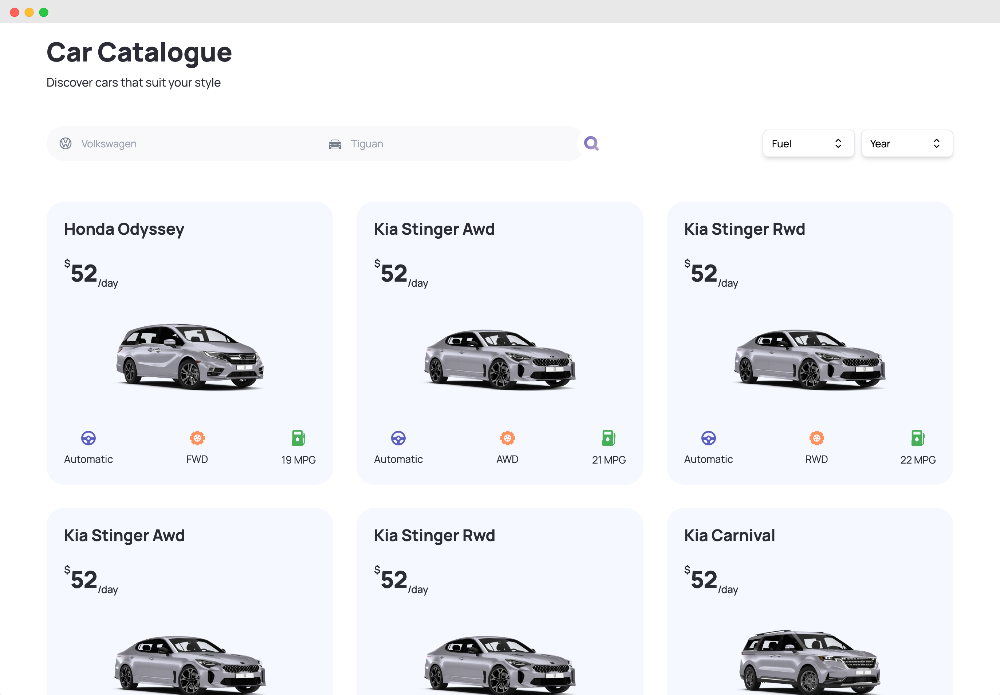

# Auto Gallery 🚗

Welcome to Auto Gallery - **Simplify Your Car Rental Journey**


## Effortlessly Discover, Rent, and Cruise with Ease! 🏎️

Check out the live site here: <https://auto-gallery.vercel.app>

Auto Gallery is the landing page for a next-gen car rental application that allows users to discover, compare, and rent cars in a simplified and convenient manner. Crafted with the latest technologies including TypeScript and Next.js, Auto Gallery provides a seamless user experience for car rental.



## Built with 🛠️

The project is built using the following technologies and libraries:

- TypeScript (5.1.3)
- Next.js (13.2.4)
- React (18.2.0)
- Tailwind CSS (3.3.2)
- Axios (1.4.0)
- ESLint (8.42.0)

## Features ⭐

- Browse a variety of rental cars 🚗
- Compare rental prices from different providers 💰
- Customize search using filters
- User-friendly design and navigation 🌐

## Getting Started 🚀

### Prerequisites

Before you begin, ensure you have met the following requirements:

- You have installed Node.js and npm.
- You have a basic understanding of TypeScript and React.
- You have signed up for an account with [API NINJAS](https://api-ninjas.com/) and obtained your API Key
- You have also signed up for an account with [IMAGIN STUDIO](https://www.imagin.studio/car-image-api) and obtained your API Key

### Installation

1. Clone the repository

```bash
git clone https://github.com/your-username/auto-gallery.git
```

2. Install NPM packages

```bash
npm install
```

3. Create a `.env` file in the project root directory and add the following environment variables in it

```env
CARS_API_KEY=<INSERT YOUR API-NINJAS API KEY HERE>
CARS_API_ENDPOINT=https://api.api-ninjas.com/v1
CAR_IMAGES_API_KEY=<INSERT YOUR IMAGIN-STUDIO API KEY HERE>
CAR_IMAGES_ENDPOINT=https://cdn.imagin.studio/getImage
```

3. Run the application

```bash
npm run dev
```

## Known Issues ⚠️

This section highlights known issues in the current version of the Auto Gallery project. These bugs are actually Next.js Issues that are still in Open Status as of June 12, 2023.

### Issue 1:

Due to a known bug in Next.js [#42292](https://github.com/vercel/next.js/issues/42292), a workaround is currently implemented in the code. This involves using `@ts-expect-error` for server components that are `async`. The problematic code is:

```jsx
{
  /* workaround*/
}
{
  /* @ts-expect-error Server Component */
}
<SomeAsyncComponent />;
```

### Issue 2

I faced an issue [#49087](https://github.com/vercel/next.js/issues/49087) where the scroll position was being reset when search parameters were updated. Due to this issue, I had to downgrade the version of Next.js I am using.

The issue, [NEXT-1147](https://github.com/vercel/next.js/issues/49087), 'Scroll position is reset when search params are updated', is still open as of June 12, 2023.

## Acknowledgments 🎉

Thanks to the open-source community for all the inspiration and knowledge.
Happy coding! 💻
